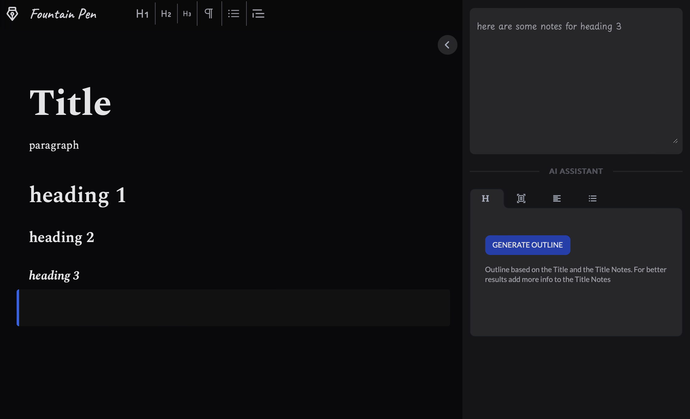

This is an editor that can help you write better, faster, using AI. The purpose of the editor is to help the writer build a develop collate research material, develop notes and content, and duild a narrative to convery about topic of the article.

## Getting Started

Build and start:

```bash
npm i
npm run build
npm start
```

OR

Development server:

```bash
npm i
npm run dev
```

Open http://localhost:3000/editor in your browser. This is what it should look like.

<picture>
  <source media="(prefers-color-scheme: dark)" srcset="./public/interface_dark.png">
  <source media="(prefers-color-scheme: light)" srcset="./public/interface_dark.png">
  
</picture>
