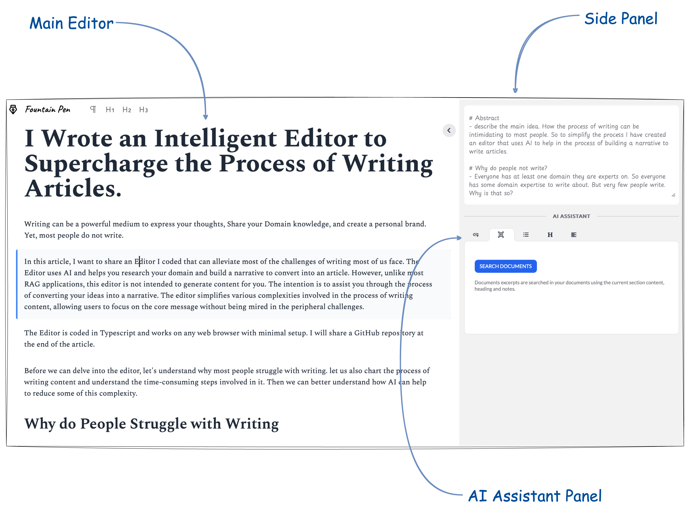

This is an editor that can help you write better, faster, using AI. The purpose of the editor is to help the writer build and develop collate research material, develop notes and content, and build a narrative to convey the topic of the article.

<picture>
  
</picture>

## Getting Started Dockerized

### Step 1:

Get an [OpenAI API key](https://openai.com).

Once you have the API key:

```bash
## go to the repository folder.
cd path/to/this_repo
## copy .env.local.example to .env.local
cp .env.local.example .env.local
```

Update the .env.local file with your OpenAI API key.

### Step 2:

Build a docker container

```bash
docker compose build
```

### Step 3:

Run the docker image

```bash
docker compose up
```

## Getting Started

### Step 1:

Get an [OpenAI API key](https://openai.com).

Once you have the API key:

```bash
## go to the repository folder.
cd path/to/this_repo
## copy .env.local.example to .env.local
cp .env.local.example .env.local
```

Update the .env.local file with your OpenAI API key.

### Step 2:

Build and start:

```bash
npm i
npm run build
npm start
```

OR

Development server:

```bash
npm i
npm run dev
```

### Step 3:

Open http://localhost:3000/editor in your browser.

The editor should look like this.

<picture>
  <source media="(prefers-color-scheme: dark)" srcset="./public/interface.png">
  <source media="(prefers-color-scheme: light)" srcset="./public/interface.png">
  
</picture>
